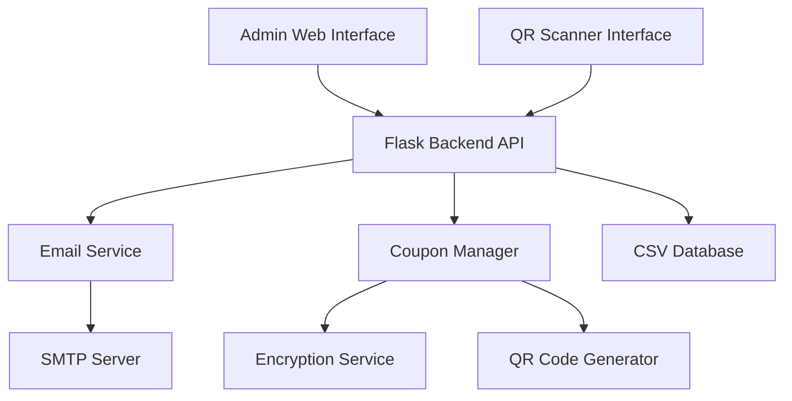
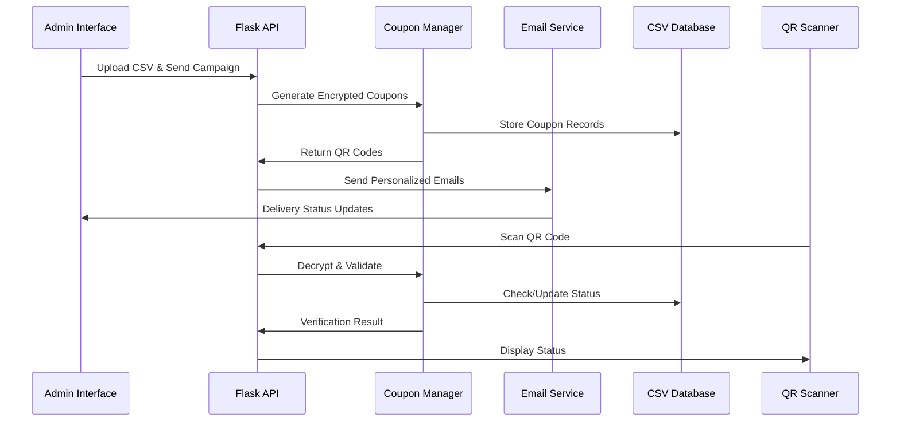

# Email Coupon System Design Document

## Overview

The Email Coupon System is a Flask-based web application that provides secure digital coupon distribution via email with QR code verification. The system consists of three main components: a backend API for coupon management, web interfaces for administration and verification, and a secure encryption system for fraud prevention.

## Architecture

### High-Level Architecture



### Component Interaction Flow



## Components and Interfaces

### 1. Flask Backend API (`app.py`)

**Core Responsibilities:**
- Route handling for web interfaces
- API endpoint management
- Request validation and error handling
- Session management and security

**Key Routes:**
- `GET /` - Main dashboard
- `GET /sender` - Sender interface
- `GET /scanner` - QR scanner interface
- `POST /send-emails` - Trigger email campaign
- `POST /verify-coupon` - Validate scanned QR code
- `GET /coupon-status/<id>` - Check coupon status
- `POST /upload-csv` - Handle CSV file uploads

**Interface Contract:**
```python
class FlaskApp:
    def __init__(self, email_service, coupon_manager):
        self.email_service = email_service
        self.coupon_manager = coupon_manager
    
    def send_campaign(self, csv_data: List[Dict]) -> Dict
    def verify_coupon(self, qr_data: str) -> Dict
    def get_coupon_status(self, coupon_id: str) -> Dict
```

### 2. Email Service (`email_service.py`)

**Core Responsibilities:**
- HTML email template rendering
- SMTP connection management
- Batch email sending with progress tracking
- Delivery failure handling and retry logic

**Key Features:**
- Jinja2 template rendering for personalized emails
- Base64 QR code embedding
- Asynchronous sending with progress callbacks
- SMTP authentication and TLS support

**Interface Contract:**
```python
class EmailService:
    def __init__(self, smtp_config: Dict):
        self.smtp_config = smtp_config
    
    def send_coupon_email(self, recipient: str, coupon_data: Dict) -> bool
    def send_batch_emails(self, recipients: List[Dict], progress_callback) -> Dict
    def render_email_template(self, template_name: str, context: Dict) -> str
```

### 3. Coupon Manager (`coupon_manager.py`)

**Core Responsibilities:**
- Unique coupon ID generation using UUID4
- AES encryption/decryption of coupon data
- QR code generation and embedding
- Coupon validation and status management

**Security Features:**
- AES-256 encryption with Fernet
- Timestamp-based validation
- Email hash integration for additional security
- One-time usage enforcement

**Interface Contract:**
```python
class CouponManager:
    def __init__(self, secret_key: str, csv_manager):
        self.secret_key = secret_key
        self.csv_manager = csv_manager
    
    def generate_coupon(self, email: str) -> Dict
    def encrypt_coupon_data(self, data: Dict) -> str
    def decrypt_coupon_data(self, encrypted_data: str) -> Dict
    def validate_coupon(self, coupon_id: str) -> Dict
    def mark_coupon_used(self, coupon_id: str) -> bool
```

### 4. CSV Database Manager

**Core Responsibilities:**
- CSV file reading and writing operations
- Data validation and sanitization
- Concurrent access handling
- Backup and recovery operations

**Schema Design:**

**Recipients CSV (`responses - Sheet1.csv`):**
```
email
technicallittlemaster@gmail.com
shuvambanerjiseal@gmail.com
```

**Coupons CSV (`coupons.csv`):**
```
coupon_id,email,encrypted_data,qr_code_data,sent_at,used_at,status
uuid-1,user@email.com,encrypted_string,qr_data,2024-01-01T10:00:00,null,sent
```

## Data Models

### Coupon Data Structure

```python
@dataclass
class Coupon:
    coupon_id: str          # UUID4 identifier
    email: str              # Recipient email
    encrypted_data: str     # AES encrypted coupon info
    qr_code_data: str      # Base64 encoded QR code
    sent_at: datetime      # Email send timestamp
    used_at: Optional[datetime]  # Verification timestamp
    status: str            # 'generated', 'sent', 'used', 'expired'
    
    def to_dict(self) -> Dict
    def from_dict(cls, data: Dict) -> 'Coupon'
```

### Email Template Context

```python
@dataclass
class EmailContext:
    recipient_email: str
    coupon_id: str
    qr_code_base64: str
    event_name: str
    expiry_date: str
    personalized_message: str
```

## Error Handling

### Email Delivery Errors
- **SMTP Connection Failures:** Retry with exponential backoff
- **Invalid Email Addresses:** Log and skip, continue with batch
- **Rate Limiting:** Implement delays between sends
- **Authentication Errors:** Fail fast with clear error messages

### QR Code Verification Errors
- **Invalid QR Data:** Return structured error response
- **Expired Coupons:** Check timestamp and return expiry status
- **Already Used Coupons:** Return usage status with timestamp
- **Decryption Failures:** Log security events and return invalid status

### File System Errors
- **CSV Read/Write Failures:** Implement file locking and retry logic
- **Backup Creation:** Automatic backups before modifications
- **Concurrent Access:** Use file locking mechanisms

### Error Response Format
```python
{
    "success": False,
    "error_code": "COUPON_ALREADY_USED",
    "message": "This coupon has already been redeemed",
    "timestamp": "2024-01-01T10:00:00Z",
    "details": {
        "coupon_id": "uuid-123",
        "used_at": "2024-01-01T09:30:00Z"
    }
}
```

## Testing Strategy

### Unit Testing
- **Coupon Manager:** Test encryption/decryption, validation logic
- **Email Service:** Mock SMTP, test template rendering
- **CSV Manager:** Test file operations, data validation
- **Flask Routes:** Test API endpoints with various inputs

### Integration Testing
- **End-to-End Email Flow:** CSV upload → coupon generation → email sending
- **QR Verification Flow:** QR scan → decryption → validation → status update
- **Error Scenarios:** Network failures, invalid data, concurrent access

### Security Testing
- **Encryption Validation:** Verify AES encryption strength
- **Replay Attack Prevention:** Test timestamp validation
- **Rate Limiting:** Verify abuse prevention mechanisms
- **Input Validation:** Test XSS and injection prevention

### Performance Testing
- **Batch Email Sending:** Test with large recipient lists
- **Concurrent QR Scanning:** Multiple simultaneous verifications
- **CSV File Operations:** Large file handling performance
- **Memory Usage:** Monitor resource consumption during operations

### Test Data Management
- **Mock SMTP Server:** For email testing without actual sending
- **Test CSV Files:** Various sizes and formats
- **Sample QR Codes:** Valid, invalid, and edge cases
- **Encrypted Test Data:** Known encryption/decryption pairs

## Security Considerations

### Data Protection
- **Encryption at Rest:** All coupon data encrypted in CSV files
- **Secure Key Management:** Environment-based secret key storage
- **Input Sanitization:** Validate all user inputs and file uploads
- **Session Security:** Secure session management for admin interfaces

### Access Control
- **Admin Authentication:** Basic authentication for sender interface
- **Rate Limiting:** Prevent abuse of verification endpoints
- **CORS Configuration:** Restrict cross-origin requests appropriately
- **File Upload Validation:** Restrict file types and sizes

### Audit Trail
- **Comprehensive Logging:** All operations logged with timestamps
- **Security Events:** Failed verifications and suspicious activities
- **Data Access Logs:** Track who accessed what data when
- **Error Monitoring:** Centralized error tracking and alerting