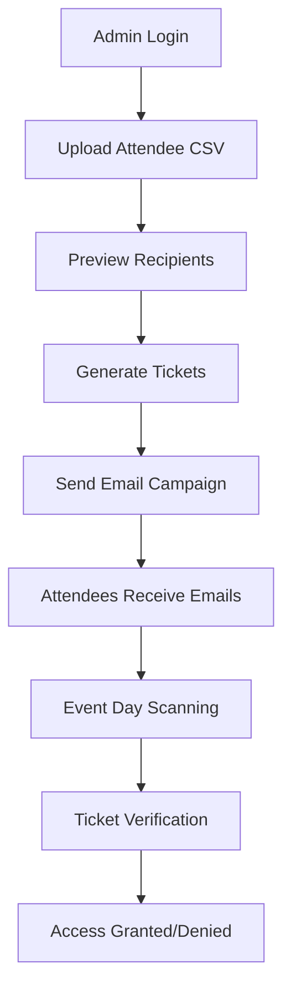

# 🎫 Event Ticket Management System

A modern, secure Flask-based web application for creating, distributing, and verifying digital event tickets with QR code technology. Features Google OAuth authentication, Gmail API integration, and a beautiful dark-themed interface.


## 🌟 Features

### 🔐 Authentication & Security
- **Google OAuth 2.0**: Secure authentication with Google accounts
- **Gmail API Integration**: Send emails directly from authenticated Gmail accounts
- **AES-256 Encryption**: Military-grade encryption for all ticket data
- **Timestamp Validation**: Automatic ticket expiration (24-hour validity)
- **One-time Usage**: Prevents ticket reuse and fraud
- **Rate Limiting**: Protection against abuse and spam

### 🎫 Ticket Management
- **Automated Generation**: Creates unique encrypted tickets for each attendee
- **QR Code Integration**: Embedded QR codes with attendee information
- **Batch Processing**: Handle large attendee lists efficiently
- **Status Tracking**: Real-time monitoring of ticket status (pending, sent, used)
- **Smart Detection**: Identifies existing vs new ticket holders

### 📧 Email Distribution
- **Beautiful Templates**: Responsive HTML emails with modern design
- **Personalization**: Customized content for each attendee
- **Progress Tracking**: Real-time sending progress with detailed feedback
- **Retry Logic**: Automatic retry for failed deliveries
- **Preview & Confirm**: Review recipient list before sending

### 📱 QR Code Verification
- **Fast Scanning**: Instant verification with automatic email extraction
- **Camera Integration**: HTML5 camera access for mobile scanning
- **Manual Backup**: Alternative verification method when camera unavailable
- **Real-time Feedback**: Immediate verification results with detailed information
- **Mobile Optimized**: Touch-friendly interface for event staff

### 🎨 Modern Interface
- **Dark Theme**: Professional dark mode with purple/blue accents
- **Responsive Design**: Works perfectly on all devices and screen sizes
- **Smooth Animations**: Glass-morphism effects and smooth transitions
- **Intuitive Navigation**: User-friendly interface for all skill levels
- **Real-time Updates**: Live statistics and progress indicators

## 🚀 Quick Start

### 1. Setup

```bash
# Clone or download the project
# Install dependencies
pip install -r requirements.txt

# Run setup script
python setup.py
```

### 2. Google OAuth Setup

To enable Google authentication and Gmail sending:

1. **Go to Google Cloud Console**: https://console.cloud.google.com/
2. **Create a new project** or select an existing one
3. **Enable APIs**:
   - Gmail API
   - Google+ API (for user info)
4. **Create OAuth 2.0 credentials**:
   - Go to "Credentials" → "Create Credentials" → "OAuth 2.0 Client ID"
   - Application type: Web application
   - Authorized redirect URIs: `http://localhost:5000/auth/callback`
5. **Update your `.env` file**:

```env
# Google OAuth Configuration
GOOGLE_CLIENT_ID=your-google-client-id-here
GOOGLE_CLIENT_SECRET=your-google-client-secret-here
GOOGLE_REDIRECT_URI=http://localhost:5000/auth/callback

# Coupon Encryption
COUPON_SECRET_KEY=your-encryption-secret-key-here
```

### 3. Add Recipients

Add email addresses to `responses - Sheet1.csv`:

```csv
email
user1@example.com
user2@example.com
user3@example.com
```

### 4. Run the Application

```bash
python app.py
```

Open http://localhost:5000 in your browser.

## 📋 How to Use

### For Administrators (Sending Campaigns)

1. **Sign In with Google**:
   - Visit http://localhost:5000
   - Click "Continue with Google"
   - Authorize the application to send emails on your behalf
   - You'll be redirected to the dashboard

2. **Upload Recipients**: 
   - Upload a CSV file with email addresses
   - The system validates email formats automatically
   - View recipient statistics in real-time

3. **Send Campaign**:
   - Enter an event name
   - Click "Generate Coupons & Send Emails"
   - Emails will be sent from your authenticated Gmail account
   - Monitor real-time progress and delivery status

4. **View Statistics**:
   - See recipient count, coupons generated, emails sent, and usage stats
   - Track campaign performance
   - Refresh stats anytime

### For Event Staff (Verifying Coupons)

1. **QR Scanner**:
   - Go to the Scanner interface
   - Click "Start Scanner" to activate camera
   - Point camera at QR code on recipient's phone
   - System automatically verifies and marks coupon as used

2. **Manual Verification**:
   - If camera doesn't work, use manual entry
   - Enter recipient email and encrypted data
   - Click "Verify Coupon"

### For Recipients

Recipients receive a beautiful HTML email containing:
- Personalized greeting
- QR code for easy scanning
- Coupon ID for reference
- Clear usage instructions

## 🏗️ System Architecture

```
┌─────────────────┐    ┌─────────────────┐    ┌─────────────────┐
│   Admin Web     │    │   QR Scanner    │    │  Email Service  │
│   Interface     │    │   Interface     │    │                 │
└─────────┬───────┘    └─────────┬───────┘    └─────────┬───────┘
          │                      │                      │
          └──────────────────────┼──────────────────────┘
                                 │
                    ┌─────────────┴───────────┐
                    │     Flask Backend       │
                    │                         │
                    │  ┌─────────────────┐   │
                    │  │ Coupon Manager  │   │
                    │  └─────────────────┘   │
                    │  ┌─────────────────┐   │
                    │  │ CSV Manager     │   │
                    │  └─────────────────┘   │
                    │  ┌─────────────────┐   │
                    │  │ Encryption      │   │
                    │  │ Service         │   │
                    │  └─────────────────┘   │
                    └─────────────────────────┘
```

## 🔐 Security Features

- **AES-256 Encryption**: All coupon data is encrypted using Fernet
- **Timestamp Validation**: Coupons expire after 24 hours
- **Email Hash Integration**: Additional security layer
- **One-time Usage**: Coupons can only be redeemed once
- **Rate Limiting**: Prevents abuse of verification endpoints

## 📁 File Structure

```
email-coupon-system/
├── app.py                    # Main Flask application with OAuth
├── google_auth_service.py    # Google OAuth and Gmail API integration
├── coupon_manager.py         # Coupon generation and validation
├── csv_manager.py            # CSV file operations
├── email_service.py          # Email sending functionality (fallback)
├── encryption_service.py     # Encryption/decryption
├── requirements.txt          # Python dependencies
├── setup.py                  # Setup script with OAuth instructions
├── .env.example             # Environment variables template
├── templates/
│   ├── login.html           # Google OAuth login page
│   ├── login_error.html     # OAuth error handling
│   ├── sender.html          # Admin interface with user info
│   ├── scanner.html         # QR scanner interface
│   └── event.html           # Beautiful email template
├── uploads/                 # Uploaded CSV files
├── coupons.csv             # Generated coupons database
└── responses - Sheet1.csv  # Recipients list
```

## 🛠️ API Endpoints

- `POST /send-emails` - Send email campaign
- `POST /verify-coupon` - Verify QR coupon
- `GET /coupon-status/<id>` - Check coupon status
- `POST /upload-csv` - Upload recipients CSV
- `GET /stats` - Get system statistics

## 🧪 Testing

The system includes test files for all major components:

```bash
python test_encryption_service.py
python test_email_service.py
python test_csv_manager.py
```

## 📧 Email Configuration

The system now uses **Gmail API** for sending emails through Google OAuth authentication. No SMTP configuration is needed!

### How it Works

1. **User Authentication**: Admin signs in with their Google account
2. **OAuth Authorization**: System requests permission to send emails
3. **Gmail API**: Emails are sent directly from the user's Gmail account
4. **Secure**: No password storage - uses OAuth tokens

### Benefits

- ✅ **No password storage** - More secure than SMTP
- ✅ **Higher delivery rates** - Gmail's reputation
- ✅ **Real sender identity** - Emails come from your actual Gmail
- ✅ **Better spam filtering** - Gmail's built-in protection

## 🔧 Troubleshooting

### Google OAuth Issues

1. **"Google OAuth is not configured" error**:
   - Ensure `GOOGLE_CLIENT_ID` and `GOOGLE_CLIENT_SECRET` are set in `.env`
   - Verify credentials are from Google Cloud Console
   - Check that Gmail API is enabled in your project

2. **"Authorization code not received" error**:
   - Verify redirect URI matches exactly: `http://localhost:5000/auth/callback`
   - Check that the OAuth consent screen is configured
   - Ensure your Google project is not in testing mode (or add test users)

3. **"Failed to connect to Gmail API" error**:
   - Check internet connection
   - Verify Gmail API is enabled in Google Cloud Console
   - Try refreshing OAuth tokens by logging out and back in

### Common Issues

1. **QR Scanner not working**:
   - Ensure HTTPS (required for camera access in production)
   - Check browser permissions for camera access
   - Use manual verification as backup
   - Try different browsers (Chrome works best)

2. **Coupon verification fails**:
   - Check encryption key consistency in `.env`
   - Verify email address matches exactly
   - Ensure coupon hasn't expired (24 hours from generation)
   - Check that coupon hasn't been used already

3. **CSV upload fails**:
   - Ensure CSV has 'email' column header
   - Check file size (max 16MB)
   - Verify email addresses are properly formatted
   - Remove any special characters or extra spaces

### Production Deployment

For production deployment:

1. **Update OAuth settings**:
   - Change `GOOGLE_REDIRECT_URI` to your domain
   - Add production domain to authorized origins
   - Update OAuth consent screen for public use

2. **Security considerations**:
   - Use HTTPS (required for camera and OAuth)
   - Set strong `SECRET_KEY` and `COUPON_SECRET_KEY`
   - Configure proper CORS settings
   - Enable rate limiting

### Debug Mode

Set `FLASK_DEBUG=true` in `.env` for detailed error messages and stack traces.

## 📝 License

This project is open source and available under the MIT License.

## 🤝 Contributing

1. Fork the repository
2. Create a feature branch
3. Make your changes
4. Test thoroughly
5. Submit a pull request

## 📞 Support

For issues and questions:
1. Check the troubleshooting section
2. Review the code documentation
3. Create an issue with detailed information

## 🎯 Use Cases

### Event Management
- **Conferences & Seminars**: Digital tickets with QR verification
- **Workshops & Training**: Secure attendee management
- **Corporate Events**: Professional ticket distribution
- **Webinars**: Email-based access control

### Marketing & Promotions
- **Product Launches**: Exclusive event invitations
- **VIP Events**: Premium ticket distribution
- **Trade Shows**: Booth access management
- **Networking Events**: Professional attendee tracking

### Educational Institutions
- **Graduation Ceremonies**: Family ticket management
- **Campus Events**: Student activity tickets
- **Guest Lectures**: Visitor access control
- **Alumni Events**: Exclusive invitations

## 🔄 Workflow Overview



## 📊 System Requirements

### Minimum Requirements
- **Python**: 3.8 or higher
- **RAM**: 512MB minimum, 1GB recommended
- **Storage**: 100MB for application, additional for logs/data
- **Network**: Internet connection for Gmail API and OAuth

### Recommended Environment
- **OS**: Linux (Ubuntu 20.04+), macOS, or Windows 10+
- **Python**: 3.9+ for optimal performance
- **RAM**: 2GB+ for handling large attendee lists
- **Storage**: 1GB+ for production deployment

### Browser Compatibility
- **Chrome**: 90+ (Recommended for QR scanning)
- **Firefox**: 88+
- **Safari**: 14+
- **Edge**: 90+

## 🚀 Deployment Options

### Local Development
```bash
# Clone repository
git clone <repository-url>
cd event-ticket-system

# Install dependencies
pip install -r requirements.txt

# Configure environment
cp .env.example .env
# Edit .env with your settings

# Run application
python app.py
```

### Docker Deployment
```dockerfile
# Dockerfile example
FROM python:3.9-slim

WORKDIR /app
COPY requirements.txt .
RUN pip install -r requirements.txt

COPY . .
EXPOSE 5000

CMD ["python", "app.py"]
```

### Production Deployment
- **Gunicorn**: WSGI server for production
- **Nginx**: Reverse proxy and static file serving
- **SSL/TLS**: Required for OAuth and camera access
- **Database**: Consider PostgreSQL for large-scale deployments

## 🔒 Security Best Practices

### Environment Variables
```bash
# Generate strong secrets
SECRET_KEY=$(python -c 'import secrets; print(secrets.token_urlsafe(32))')
COUPON_SECRET_KEY=$(python -c 'import secrets; print(secrets.token_urlsafe(64))')
```

### OAuth Security
- Use HTTPS in production
- Regularly rotate OAuth credentials
- Monitor OAuth usage and logs
- Implement proper session management

### Data Protection
- Encrypt sensitive data at rest
- Use secure communication channels
- Implement proper access controls
- Regular security audits

## 📈 Performance Optimization

### Large Attendee Lists
- **Batch Processing**: Handle 1000+ attendees efficiently
- **Async Operations**: Non-blocking email sending
- **Progress Tracking**: Real-time feedback for large operations
- **Memory Management**: Optimized for large CSV files

### Scaling Considerations
- **Database**: Migrate from CSV to PostgreSQL for 10,000+ attendees
- **Caching**: Implement Redis for session management
- **Load Balancing**: Multiple application instances
- **CDN**: Static asset delivery optimization

## 🧪 Testing Strategy

### Unit Tests
```bash
# Run individual test files
python test_encryption_service.py
python test_email_service.py
python test_csv_manager.py
python test_coupon_manager.py
```

### Integration Tests
```bash
# Test complete workflows
python -m pytest tests/integration/
```

### Security Tests
- OAuth flow validation
- Encryption/decryption verification
- Input sanitization testing
- Rate limiting validation

## 📋 Changelog

### Version 2.0.0 (Current)
- ✨ Modern dark theme UI
- 🔐 Google OAuth authentication
- 📧 Gmail API integration
- 🎫 Event-focused terminology
- 📱 Enhanced mobile responsiveness
- 🔍 Dynamic attendee list viewer
- ✅ Preview & confirmation dialogs
- 🗑️ Email removal functionality

### Version 1.0.0
- 📧 Basic email coupon system
- 🔒 AES encryption
- 📱 QR code generation
- 🖥️ Web interface
- 📊 Basic statistics

## 🤝 Contributing Guidelines

### Development Setup
1. Fork the repository
2. Create a virtual environment
3. Install development dependencies
4. Run tests before committing
5. Follow code style guidelines

### Code Style
- **Python**: Follow PEP 8 guidelines
- **JavaScript**: Use ES6+ features
- **HTML/CSS**: Semantic markup and modern CSS
- **Comments**: Document complex logic

### Pull Request Process
1. Create feature branch from `main`
2. Make changes with descriptive commits
3. Add/update tests as needed
4. Update documentation
5. Submit pull request with detailed description

## 📞 Support & Community

### Getting Help
- 📖 **Documentation**: Comprehensive guides and API reference
- 🐛 **Issues**: Report bugs and request features
- 💬 **Discussions**: Community support and questions
- 📧 **Email**: Direct support for critical issues

### Community Guidelines
- Be respectful and inclusive
- Provide detailed information when reporting issues
- Help others when possible
- Follow the code of conduct

## 🏆 Acknowledgments

### Technologies Used
- **Flask**: Web framework
- **Google APIs**: OAuth and Gmail integration
- **Cryptography**: Encryption and security
- **QR Code**: Ticket generation
- **HTML5**: Modern web standards

### Contributors
- Initial development and architecture
- UI/UX design and implementation
- Security and encryption features
- Testing and quality assurance

## 📄 License

```
MIT License

Copyright (c) 2024 Event Ticket Management System

Permission is hereby granted, free of charge, to any person obtaining a copy
of this software and associated documentation files (the "Software"), to deal
in the Software without restriction, including without limitation the rights
to use, copy, modify, merge, publish, distribute, sublicense, and/or sell
copies of the Software, and to permit persons to whom the Software is
furnished to do so, subject to the following conditions:

The above copyright notice and this permission notice shall be included in all
copies or substantial portions of the Software.

THE SOFTWARE IS PROVIDED "AS IS", WITHOUT WARRANTY OF ANY KIND, EXPRESS OR
IMPLIED, INCLUDING BUT NOT LIMITED TO THE WARRANTIES OF MERCHANTABILITY,
FITNESS FOR A PARTICULAR PURPOSE AND NONINFRINGEMENT. IN NO EVENT SHALL THE
AUTHORS OR COPYRIGHT HOLDERS BE LIABLE FOR ANY CLAIM, DAMAGES OR OTHER
LIABILITY, WHETHER IN AN ACTION OF CONTRACT, TORT OR OTHERWISE, ARISING FROM,
OUT OF OR IN CONNECTION WITH THE SOFTWARE OR THE USE OR OTHER DEALINGS IN THE
SOFTWARE.
```

---

**🎫 Built with passion for seamless event management**

*Transform your events with secure, modern digital ticketing*